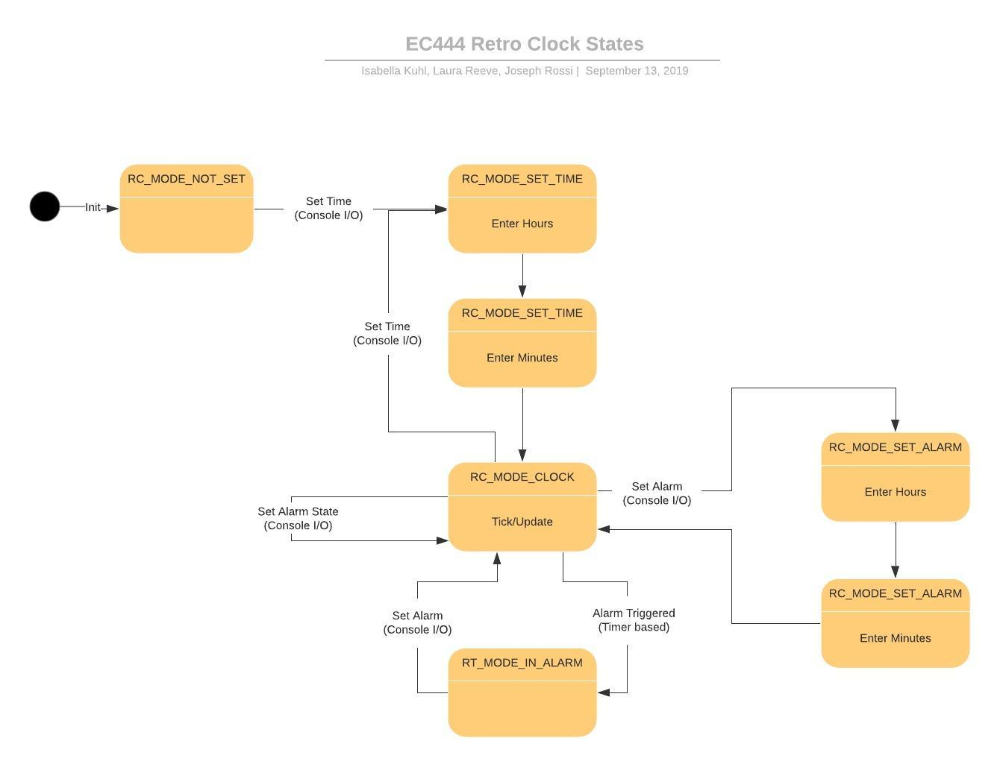

# Retro Alarm Clock

This document outlines the different input and out components of the retro 
alarm clock and how they are synchronized with the time keeping subsystem.

The various component specifications are in separate documents that will
be linked to as the components are introduced.

## System Overview

> TODO: Describe hardware components, GPIO setup and hardware timer mechanism

## Software Overview

The software for this clock is organized as the state machine diagrammed below:

### Time Keeping

The data managed by the system includes:

* The clock time
* The alarm time
* The current state
* Whether the alarm is enabled or disabled

When in clock mode, the time management subsystem using a hardware timer trigger updates.
The full specification is in [Retro Clock Time Keeping Specification](./time_keeping.md)

### Input

The only external input available to a user is through a UART tty console connected
via USB. The console is responsible for allowing the user to take action on the 
system including:

* Setting the clock time
* Setting the alarm time
* Enabling or disabling the alarm
* Dismissing and active alarm

The full input specification is detailed in the 
[Retro Clock Console I/O Specification](./console_io.md)

### Outputs

There are two outputs in this system, the clock hands and the alphanumeric display.
The full specification for these is in the [Retro Clock Output Specification](./clock_outputs.md).
The output's only role is read the data and follow the specification to output

