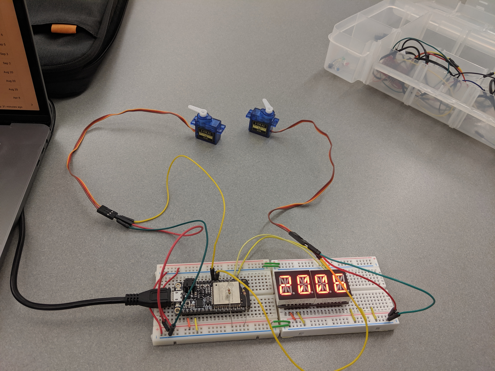
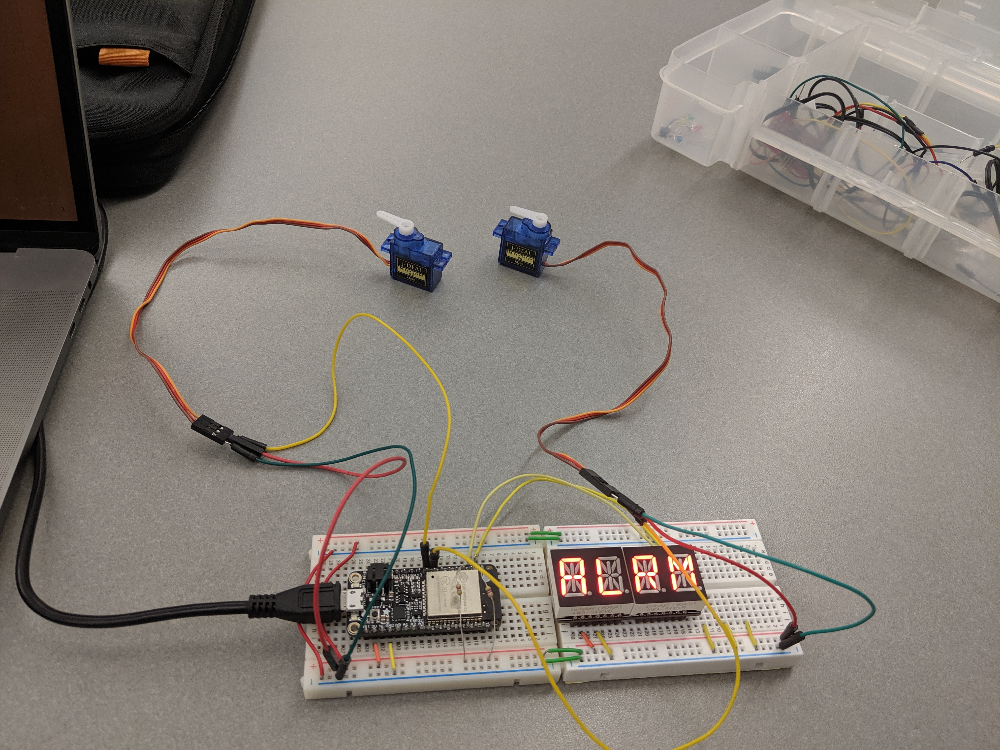

# Quest 1 - Retro Alarm Clock

Authors: Joe Rossi, Isabella Kuhl, Laura Reeve

2019-09-19

## Summary

For this quest we designed the clock by breaking it down into three subsystems:

* Inputs - Laura Reeve
* Time Management - Joseph Rossi
* Outputs - Isabella Kuhl

This breakdown allowed us to work failry independently after we agreed on a deisgn and a way
to interface between out code. Details about the various subsystems can be found in the
[Solution Design](#solution-design) or in the [clock specifications](./specs/overview.md).

## Evaluation Criteria

We tested the functionality by following this test protocol:

1. Power up the clock
    * Check the display blinks '----'
2. Follow the console prompt to set the time
    * The display should be blinking
    * The hours and minutes should display
    * The display should stop blinking when set
    * The hands should start rotating clockwise.
3. Via the console, set an alarm time 1 minute after the current time.
    * The display should be blinking.
    * Once, set, the clock should return to displaying the time.
4. Via the console, enable the alarm.
5. Wait one minute
    * The display should flash "ALRM"
6. Press 'd' to dismiss the alarm.
    * The user should be prompted to type the word "dismiss" to turn
      off the alarm.
    * The clock should go back to displaying the time without flashing.

## Solution Design
> The design is detailed in the specification documents in the [specs](./specs) folder.
> A good place to start is with the [Overview](./specs/Overview.md).

The input subsystem implemented a console interface that allows a user to take the following
actions:

* Set Time
* Set Alarm Time
* Enable Alarm
* Disable Alarm (also used to dismiss an active alarm)

When the user takes action, time keeping APIs get called to change the clocks state, whether that
bet the changing mode, the clock time, or the alarm time. The console interface uses UART to
communicate with the users terminal.

The time keeping subsystem uses a hardware timer to keep time, and uses that timer's alarm to trigger an
interrupt when its time to alert the user. When running, there are multiple background tasks that begin.
One polls the hardware timer to update the system clock, while another periodically updates observers
that registered callbacks to be notified when the state changes. See `struct retro_clock_t` in
[retro_clock.h](./code/main/retro_clock.h) to see all of the state the clock keeps.

Any peripheral that would like to react to the clock's time keeping mechanism simply needs to implemented a
function matching the `clock_update_callback` definition in [retro_clock.h](./code/main/retro_clock.h). Once
implemented, the output can be easily hooked up by adding the appropriate init and register calls in `app_main`.

> A nice improvement to this system would be to setup Queues for communicating with outputs. Currently, if one of
> the registered outputs takes a long time to return, it will delay any callbacks that follow it. (Callbacks are
> invoked in the order they are registered)

## Investigative Question
How can you synchronize multiple ESP clocks with each other? Elaborate

If we want to synchronize multiple clocks with each other, the two best protocols to use would be Network Time Protocol (NTP) or Precision Time Protocol (PTP). PTP is incredibly accurate due to hardware timestamping, using multiple timestamps to sync a slave clock to a master clock. NTP is slightly less accurate but does not require hardware timestamping. In the ESP-32 specifications, they claim to have PTP hardware support, so PTP could be an option, but unless extremely high precision is necessary, NTP is simpler to implement. To start, we can set up a LAN server that all of the ESP devices can use to communicate. Both of the protocols send and recieve timestamps to establish a common time. NTP uses a hierarchical structure to establish proper time (generally UTC), but if we want these clocks to synchronize without using UTC, we can establish our own server times. Then all of the clocks will poll these higher clocks by sending and recieving timestamps (via UDP), using these to calculate the offset and delay and update its time to match up with those higher level clocks. 

One of the potential issues that we'd face would be knowing which clock(s) from the group to use to set our server clock values. If our goal is to use a user-inputted time to sync all of the clocks, that could be used as our base server clocktime. Otherwise, finding the mean of the clock times (excluding outliers) using, for example, the Berkeley algorithm, which doesn't require any seed time and simply finds an average time across multiple clocks and polls the slave clocks. Then we could use this time as the server time for our NTP implementation.

## Sketches and Photos

Clock with time set

Alarm sounding

## Supporting Artifacts

- [Link to repo](https://github.com/BU-EC444/Team15-Kuhl-Reeve-Rossi/tree/master/quest-1)
- [Demo Video](https://youtu.be/RS9ZWK7hZXk)

## References

-----

## Reminders

- Video recording in landscape not to exceed 90s
- Each team member appears in video
- Make sure video permission is set accessible to the instructors
- Repo is private
