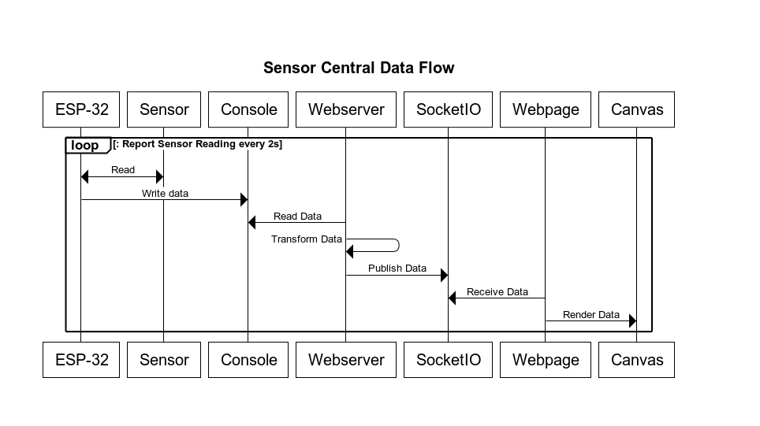

# Sensor Central 
Authors: Isabella Kuhl, Laura Reeve, Joseph Rossi

2019-10-01

## Summary

For this quest we divided the work into two segments, the hardware layout and firmware 
development running on the ESP32 and the web server/live plotting application for graphing
the readings. Bella and Laura paired up to work on the hardware layout and firmware
development and Joe wrote the code to read the console output of the sensor and graph
it on a webpage.

The ESP32 reads sensor data every two seconds, and writes a JSON string to the console,
which the NodeJS server reads through the serial interface and forwards the data along
to the webpage which live-plots the data. Additionally, the web server logs the data
recording out to a CSV that can be rendered statically on the webpage.


## Evaluation Criteria

**Perodic reporting of ultrasonic in m** - The firmware reads and reports the ultrasonic
sensor every 2 seconds and writes the reading to the console. The code reading the analog
voltage converts volts into meters.


**Perodic reporting of IR range in m** - The firmware reads and reports the IR range
sensor every 2 seconds and writes the reading to the console. The code reading the analog
voltage converts volts into meters based on information from the datasheet  for the sensor.

**Perodic reporting of temperature in C** - The firmware reads the voltage of the thermistor
circuit every 2 seconds and converts the voltage into celcius based on thermistors 
characteristics described in the datasheet.

**Results Graphed at Host** - The web sever, running on port 8080, graphs the data from
the senors on CanvasJS charts.

**Results graphed continuouly based on reporting period** - The webpage receives new
data every 2 seconds via a websocket and updates the graphs. It keeps a 1 minute window of
data points for each sensor.

## Solution Design

The data flow for this implementation is depicted below:

<center></center>


### Hardware

Below is a schematic depicting the sensor central circuit.  All of the sensors are 
capable of operating at 5.5V, we used the USB output pin to power the sensors. Then, 
each output from the sensor was hooked up to a different ADC input pin.  All sensors 
were hooked up to channels on ADC unit 1.

> TODO: Insert schematic


### Firmware

> TODO: Firmware Report 


### Software 

The web server for this project was written using NodeJS. It provides a single webpage
(index.html) that loads the scripts necessary to plot the data in real time.

The server uses the `serialport` npm package to read the serial output from 
the ESP32.  The firmware was written to output new data as JSON strings, so it was trivial 
to javascript's built-in library function `JSON.parse` to read the data.  The sensor data  
is then transformed into a data structure  suitable for the client code.

> Note: The webpage runs on port 8080 by default: http://localhost:8080

The webpage, on load, initiates  a websocket connection to the web server and listens for the
`data` event. When received it expects data to be published in the following format:

```
interface SensorValue {
    name: string,
    units: string,
    value: float
}

interface SensorReading {
    timestamp: string // UTC Date String
    sensorValues: SensorValue[]
}
```
If the payload received is not in this format, the message will be ignored. 

> Note: The web server is responsible for time-stamping the data when it was received. That is
> the client code expects the `timestamp` value to be filled out.  


There are three charts on the page. Since the Ultrasonic and IR Rangefinder sensors are both
measuring distance, they are plotted against each other on the same chart. The battery and 
thermistor data are plotted on separately labeled charts.  When a message is received, the 
script running in the browser adds the data to the appropriate chart based on the 
`name` of the `SensorValue.`

> The units field was intended to provide a dynamic way of grouping all data that shared
> the same units onto a single chart, rather than hard-coding which chart gets which data.
> The implementation details behind this got a bit unwieldy for a small project, but the 
> field remains.

Finally, When the web server starts up, it starts recording sensor data to a file 
named `sensors.csv`. The webpage can then render this data by simply adding the query
string `?csv=sensors.csv` to the URL.  Live streaming  data is ignored when rendering 
data from a file.


## Sketches and Photos


## Investigative Question


### Ultrasonic Sensor

Based on the [datasheet][1] the ultrasonic sensor will update its readings every 
50 milliseconds, so should not be sampled faster than 20 Hz.


### Infrared Distance Sensor

The timing chart in the [datasheet][2] (page 4) shows that the distance 
sensor has a measurement period of approximately 38.3ms ± 9.6ms, so the 
maximum  sampling rate should be between 21Hz and 34Hz.

Additionally, the timing chart shows the first measurement as being unusable. 
The initial reading should be delayed 43ms ± 9.6ms after being powered on.


### Battery & Thermistor

The battery and thermistor readings are both limited by the sample rate
of the ESP32's ADCs. From page 23 of the [ESP32 datasheet][3], The maximum 
sampling rate of the inputs on the RTC Controller are 200 ksps, so their values should not
be sampled greater than the theoretical  rate of 200kHz.

[1]: https://www.maxbotix.com/documents/LV-MaxSonar-EZ_Datasheet.pdf
[2]: https://www.sparkfun.com/datasheets/Sensors/Infrared/gp2y0a02yk_e.pdf
[3]: https://www.espressif.com/sites/default/files/documentation/esp32_datasheet_en.pdf#page=30


## Supporting Artifacts
- [Link to repo](https://github.com/BU-EC444/Team15-Kuhl-Reeve-Rossi/quest-2)
- [Link to video demo](https://youtu.be/oHcK3RRd34U)


## References

* [MF52 Thermistor Datasheet](https://www.eaa.net.au/PDF/Hitech/MF52type.pdf)
* [MaxSonar Ez Datasheet](https://www.maxbotix.com/documents/LV-MaxSonar-EZ_Datasheet.pdf)
* [Sharp Rangefinder Datasheet](https://www.sparkfun.com/datasheets/Sensors/Infrared/gp2y0a02yk_e.pdf)


-----

## Reminders

- Video recording in landscape not to exceed 90s
- Each team member appears in video
- Make sure video permission is set accessible to the instructors
- Repo is private
