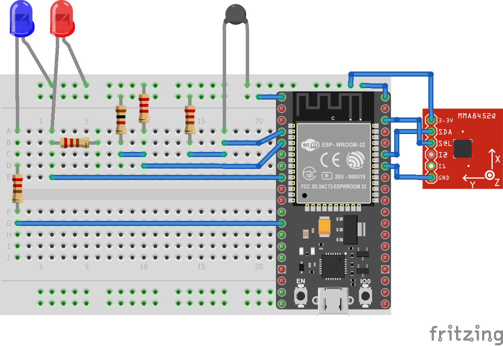
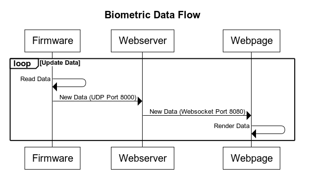
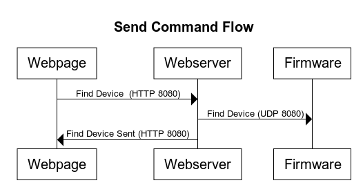

# Quest 3: Wearable Computer with Remote Access
Authors: Joseph Rossi, Isabelle Kuhl, Laura Reeve

2019-10-22

## Summary

In this quest, we created a fitness tracker that allows the user to track their steps, body temperature, and phone battery. The user can also be alerted; a blue LED blinks to remind the user to drink water and a red LED blinks to locate the device. The data collected is displayed on a web server hosted the Raspberry Pi. The website is accessible through a public URL made possible via DDNS, allowing the user's friends and family to view the fitness metrics.


## Evaluation Criteria

Measurements for step, body temperature, and battery level - The firmware reads in the data from the thermistor, battery, and accelerometer to continuously poll for these measurements.

Regularly scheduled alerts [to drink water] (blinks blue LED)

An online portal displaying a real-time status report

Ability to find your device from web portal (blinks red LED)

Remote access to turn off features (i.e., only measure steps but no temperature) and view the portal

## Solution Design

### Hardware

Below is a diagram of the wiring setup for the fitness tracker. Each sensor uses 3.3v from the ESP32 and the battery monitor and thermistor use the ADC pins. The LED are connected using 220 ohm resistors to GPIO pins. Finally, the accelerometer uses SDA and SCL pins to communicate over I2C.

<center></center>

### Firmware

The firmware was broken up into parts for the temperature, battery level, step counter, and alert system. The temperature and battery level files are based on the ADC example code. For the battery monitor, we measure the voltage across a voltage divider consisting of two 10k resistors in series using ADC. For the thermistor, we again use a voltage divider to measure the voltage drop across the thermistor, then use this to calculate the resistance. From there, we calculate the temperature using the values given on the spec sheets for the NTC thermistor and convert those values from Kelvin to Celsius.

For the step counter, we used the ADXL343 Accelerometer and an i2c master-slave configuration to read in the acceleration in the x, y, and z directions. From here, we used the acceleration on the z-axis to measure steps. We do this because the vertical direction is where you get the greatest fluctuations when a person is walking. We have a threshold variable that that is updated every second that takes the mean of the max and min values from that second. When the z acceleration goes above that threshold, it is seen as a 'step'.

For the alert system, we have two different alerts that the user can implement. The first alert is a scheduled reminder to drink water. This is scheduled to flash the blue LED on a regular interval (every x seconds). The second alert is an immediate on/off switch for the user to find the device. When on, it continuously flashes the red LED until the user switches it to off.

### Software

The web server is written for NodeJS. It uses ExpressJS and Socket.IO to implenet a web app that receives biometric data through a websocket and can send commands to the wearable via an HTTP API. The firmware settings can be updated via a UDP message, after being received by the web server through an HTTP request from the web app.

##### Network Configuration

In the router settings, the Raspberry Pi and ESP32 are assigned static IP addresses so the IPs can be hard coded in the firmware and software. Additionally, the router is configured to route any traffic coming in on port 80 to the Pi's webserver on port 8000. Finally, we configured the router to update a DDNS service with a domain Joe has registered with Namecheap which allows users to access the webpage via the URL: http://ec444group15.josephrossi.us

#### Receiving Biometric Data

Every 2 seconds, the firmware reads the sensors and sends a UDP datagram to the Pi's IP and port listening for UDP traffic. The message sent is a JSON string in the following format:

```
{
    "battery_volts": <battery>,
    "temperature_degc": <temp>,
    "steps": <steps>,
    "alert_period_seconds": <step>
}
```

Message data is then emitted through a websocket to the web client.

<center></center>

#### Updating Settings

From the webpage, the viewer can toggle different wearable settings. For example, you can turn on and off reporting the different sensor valus, update the drink water alert period, or turn on and off "Find My Device". Here is the data flow for updating wearable settings:

<center></center>

To summarize the diagram:

* The firmware listens for UDP messages on port 8080.
* The web server receives and HTTP request from the webpage.
* The server then sends a datagram to the wearable (static IP) port 8080 with the desired settings.

To avoid having to parse a JSON message on the firmware, the settings call expects a binary message to come through
that matches the `WearableSettings_t` struct defined in [wearable.h](./code/firmware/main/wearable.h#L=38)

#### Libraries and Frameworks

- [NodeJS](https://nodejs.org/en/)
- [Express](https://expressjs.com/)
- [Socket.IO](https://socket.io/)
- [Smoothie Charts](http://smoothiecharts.org/)
- [Axios](https://github.com/axios/axios)

## Sketches and Photos


## Supporting Artifacts

- [Link to repo]()
- [Link to video demo]()

### Investigative Question

**What are steps you can take to make your device and system low power?**

In order to make the system low power we would redesign the system to draw less current. One adjust that would achieve this is switching the pedometer feature to use a tilt switch rather than an accelerometer. As a passive element, the tilt switch draws minimal current where as the accelerometer uses I2C and an on board IC to calculate orientation. While the accelerometer gives a more accurate step reading, the tilt switch would lower the overall power usage of the track.

Another way to lower power usage is reducing the frequency at which data is sent to the server. Pushing data to the server via WiFi draws a lot of current so collecting data and pushing every five seconds rather than in real time would decrease the number of times a packet is sent and therefore the total current drawn.

A final method of reducing power is to implement a sleep mode that stops collecting steps and temperature when the user is sitting down or sleeping. Reducing the amount of data collected each second and the number of sensors running will reduce current drawn.


## References

* We referenced Emily Lam's [base code](https://github.com/BU-EC444/code-examples/tree/master/i2c-accel) for accelerometers.

* We referenced the [datasheet](https://cdn-learn.adafruit.com/assets/assets/000/070/556/original/adxl343.pdf?1549287964) for the accelerometer for connecting it and interpreting the values.

* We used DFRobot's [tutorial](https://wiki.dfrobot.com/How_to_Use_a_Three-Axis_Accelerometer_for_Tilt_Sensing) for the equations to translate the x, y, z values from the sensor into pitch, roll, and yaw.
-----

## Reminders

- Video recording in landscape not to exceed 90s
- Each team member appears in video
- Make sure video permission is set accessible to the instructors
- Repo is private
