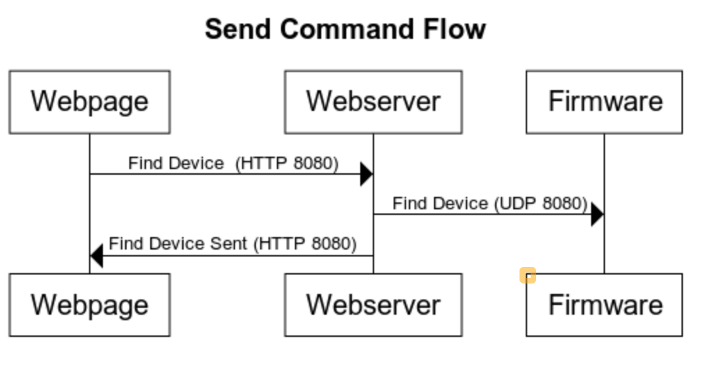
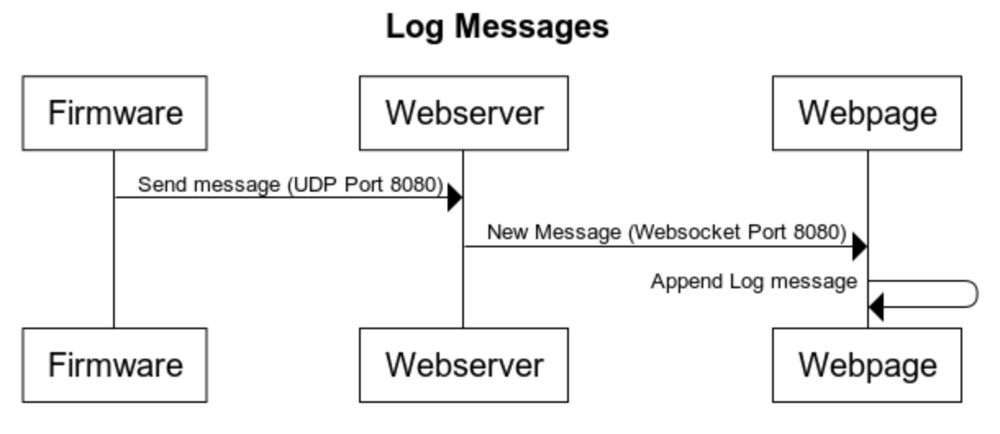
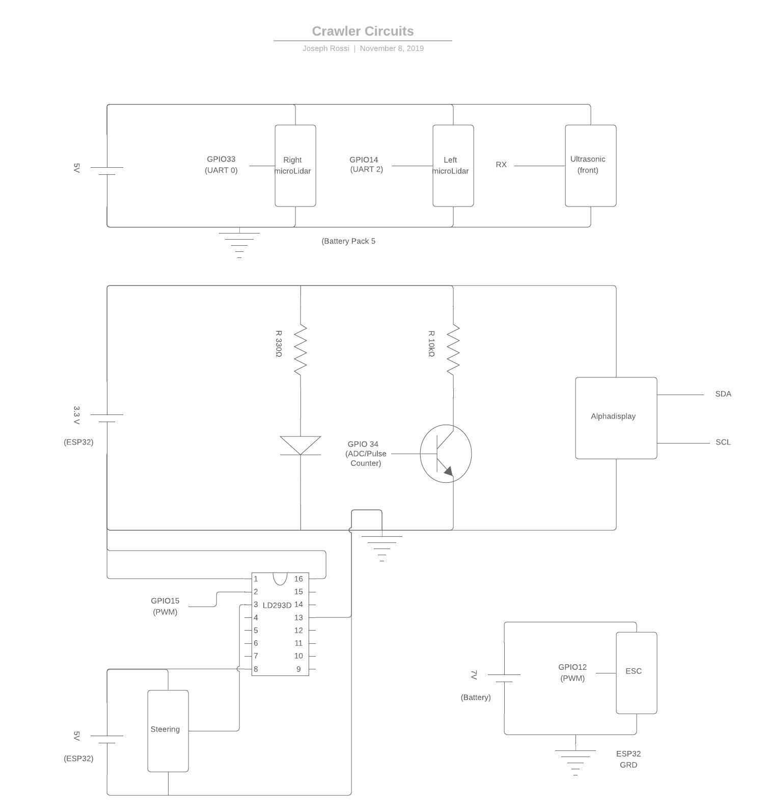
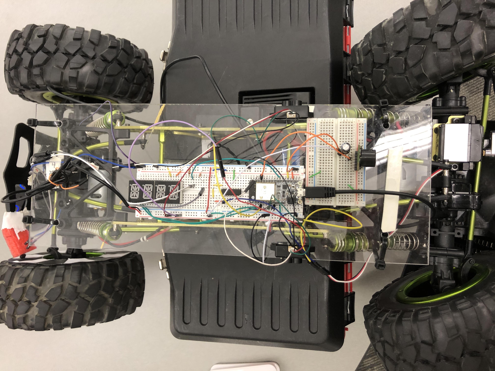

# Crawler
Authors: Isabella Kuhl, Laura Reeve, Joseph Rossi

2019-11-06

## Summary

In this quest, we interfaced with the provided crawlers to create an autonomous driving system. The criteria for this project is that the vehicle has to drive straight along a designated line, maintaining a speed of 0.1 - 0.4 m/s. The system also needs to rely on PID control to control both the speed and the steering as well as stop within 10cm of an obstacle. We executed this by using skills learned previously; the microLIDAR and ultrasonic sensors were mounted on the side and front of the vehicle and allow us to sense how far away obstacles are. Specifically, the microLIDAR sensors were mounted on both sides of the crawler and their readings determined how much the steering was adjusted in order to maintain an equal distance from the walls. The ultrasonic was mounted on the front, detecting how far objects were, and stopping the vehicle before it crashed.

We also setup a webserver to control the crawler's speed, direction, and steering wirelessly. Along with controlling the movement, a log console allows the user to continuously see the values outputted by the various sensors as the device operates. Finally, we have an alphanumeric display showing the user what the current speed is, based on the calculated wheel speed. Wheel speed is calculated by using an optical encoder pointed at a repeating patter stuck to the rear wheel. As the motors turn, the pattern turns as well and the optical encoder sends back varying voltages in a pulse wave form that can then be used (along with the diameter of the tire) to determine how far the car has gone. This information is used to calculate the error through PID control, thus updating the motor speed.

## Evaluation Criteria

**Uses PID for speed control between  0.1 and 0.4 m/s**

Using just the proportional aspect of PID control, we periodically measure the
speed of left right wheel and the PID control will adjust the wheel speed.

**Stops within 10cm of the end**

The ultrasonic sensor is placed such that the front of the car + 10cm is
the minimum range of the sensor (30cm). When the car detects an object
less than 35cm in front of it, the car will stop.

**Uses alpha display to show current position or speed**

The speed is printing to the alpha display every measurement period.

**Successfully transverses A-B in one go, no hits or nudges**

In our testing, it did so as long as the ultrasonic sensor was behaving.

## Solution Design

### Speed and PID Control

In order to control the speed of the crawler we utilized PID control. The sensors used to collect the data needed to adjust the motors were the microLIDAR and an optical sensor. The optical sensor outputs voltages corresponding to the amount of light reflected back from different surfaces. This means that white and black surfaces will output different voltages and thus can be distinguished. Utilizing this, we attached a repeating pattern of black and white wedges to the inside of the rear tire on the crawler. As the wheel turns, we count the number of times the voltage changes and can therefore know how far the crawler has gone given the diameter of the tires. If the user inputs a desired speed we can use PID control to see how far the motors have turned and compare this to how far they *should* go. This in turn either increases or decreases the power supplied to the motors.

PID control allowed us to adjust this power more dynamically than simply adding or subtracting a set error value. The proportional adjustment part of PID does the above operation while the integration and derivative parts account for large errors as well as consistent errors that occur overtime. As mentioned, these components allow for more controlled and accurate adjustments.

### Distance Sensing

For sensing objects in front of the crawler, we used the ultrasonic sensor.
To get the most accurate readings we decided to use the serial output from the sensor. 
We positioned the sensor approximately 25cm from the
front of the crawler. In auto mode, we poll every 100ms for a distance reading, when we get 
at least 2 readings that are less than 38cm from the sensor, the crawler stops. The extra 3cm 
allows for a little bit of room for stopping distance.

### Steering Control

For the steering control, we used two lidars on either side of the crawler to calculate distance from the wall on each side. Then we take the difference and use this to adjust the steering to bring the difference to zero. If the difference is great, then it will turn more than if the distance is small. This allows the crawler to stay in the middle of the track.

### Web Controls

We designed a web interface to be able to control the crawler remotely. We used the same
UDP communication protocol to both send commands to the crawler and receive messages from
to be able to debug issues without necessarily being connected. The available commands
are:

* Calibrate
* Increase the ESC (forward)
* Decrease the ESC (reverse)
* Stop the ESC
* Steer Left
* Steer Right
* Steer Center
* Start Auto
* Stop Auto

The webserver is a NodeJS program (using express.js) that provides a simple API for sending
commands and Socket.IO to proxy messages from the crawler to the webpage. Send and receive both
use UDP messaging.

## Sketches and Photos

  

 

## Supporting Artifacts
- [Link to repo](https://github.com/BU-EC444/Team15-Kuhl-Reeve-Rossi/tree/master/quest-4)
- [Link to video demo](https://drive.google.com/open?id=1F8LkDDblGAYg2ol6MR_veic3Qc58igqU)

## Investigative Question

When hooking up sensors to our crawler, we found a few areas where there could be improvement. Firstly, we used microlidars on the side of the vehicle to keep the car moving straight along a wall. The main problem that we had with the microlidars was the amount of current that they pulled. We added an extra battery that was solely used for the two LiDARs, but without the extra battery, one of the microlidars was not working, which was causing the vehicle to swerve into a wall. The reason why we still used these instead of another sensor is because they are by far the most accurate and, more importantly, consistent. Many of the other sensors were relatively accurate, but we couldn't rely on two to read in the same values consistently. For example, our sonar sensors were fairly accurate, but they had enough variation in readings that they wouldn't be able to stay straight. What would have been perfect for the side sensors would've been a set of ultrasonic sensors or rangefinders that was very consistent, detected reflective surfaces, and didn't draw too much current. We used a solid wall, so their problems with glass were avoided, but this would be a problem if we had to go along a reflective surface.

We would have the same requirements for the front sensor. We chose to use the ultrasonic sensor because it didn't run into any problems with reflective surfaces. Our biggest problem with this sensor was the lack of accuracy and the minimum distance being 30cm. To account for the distance problem, we fixed it further back (approx. 20 cm from the front of the vehicle), but this sensor was a bit less accurate than the lidars. We also added in a check for multiple short distances (<30cm) before it stopped, because occasionally it would throw strange values. I think the best method would be to have both a LIDAR sensor and an ultrasonic sensor so when there is a non-reflective surface, the LIDAR will sense it, but when there is, you'll still have the ultrasonic sensor ensuring that you don't run into anything.

Also, when reading about sensors used by self-driving cars, we found that many companies used radar and/or video cameras to sense objects alongside sonar and lidar sensors. We think these may also help to ensure proper stopping distance and balance out potential noise with the other sensors. There are [radar sensors specifically for short and long distance sensing] (https://levelfivesupplies.com/sensors-used-in-autonomous-vehicles/) and we think those would help because our LiDAR sensor gets a bit confused when pointed at a wall/object out of it’s scope.

## References

* We referenced the provided [PID design template](http://whizzer.bu.edu/briefs/design-patterns/dp-pid) to structure the PID control code.

* We referenced a [PID tutorial](https://www.teachmemicro.com/arduino-pid-control-tutorial/) to learn more about PID control.

-----

## Reminders

- Video recording in landscape not to exceed 90s
- Each team member appears in video
- Make sure video permission is set accessible to the instructors
- Repo is private
