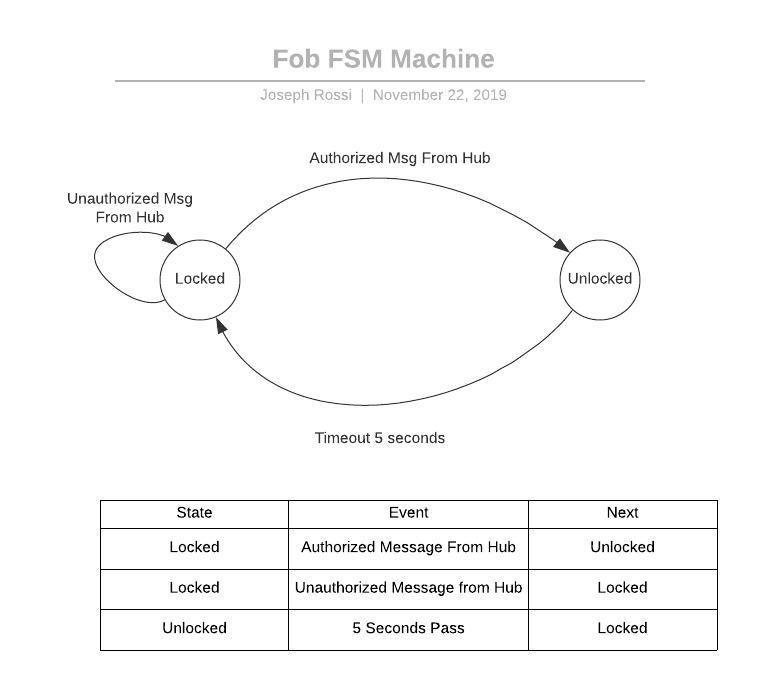
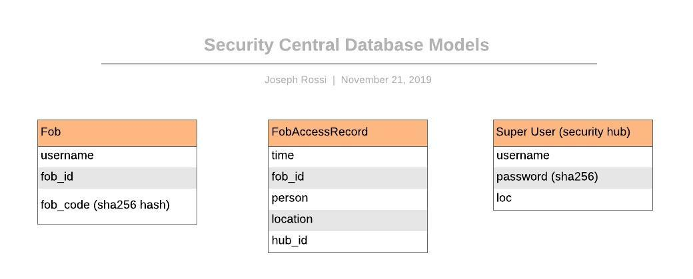

# Quest Name
Authors: Isabella Kuhl, Laura Reeve, Joseph Rossi

2019-11-20

## Summary

In this quest, we implemented a device that acts as a security key fob. When a button on the fob is pressed, the user's unique ID and code is sent to a security hub. The hub then checks that the ID and code match one saved in the system and logs this to a server hosted on a Raspberry Pi.

## Evaluation Criteria

### Fob relays {fob_ID,code} to security hub, hub sends {fob_ID,hub_ID,code} to server; server responds to fob, fob green light turns on.

The fob sends out 4 bytes with the ID and code, which the hub receives and transmits to the server. The server responds whether or not the id-code pair is valid, and then the security hub transmits 9 for yes, 3 for no to the fob.

### Logs fob accesses to database {fob_ID,hub_ID,person,time,location}

Server logs every access to the DB. It logs who accessed, when they accessed, and which location they accessed.

### Database is on RPi

When we power down the RPi and power it back up, all of the logs are still persistent.

### Web-based management interface shows real-time active unlocked fobs and history of unlocked fobs (with actual time of unlock). 

Our web app shows a log of all unlocks by each user along with their unlock time. After 5 seconds, it 'relocks' the user out and turns off the light on the fob. So each fob is only unlocked for 5s after each unlock signal. 

### Uses at least 3 fobs with unique IDs

We have three fobs set up: Joe, Laura, and Bella. Each has it's own ID and code as follows:

Person: {id, code}
Joe: {4810, 6650}
Laura: {3506, 1259}
Bella: {7965, 1998}

## Solution Design

### Key Fobs

There are three key fobs that we built, each with its own user ID and access code. Each fob transmits a hex encoded code at the press of a button while also continuously receiving a LOCKED or UNLOCKED signal from the hub. The ESP RMT is used to produce a 38kHz signal that is then ANDed via a motor driver with the signal from the transmitter. This is the decoded by the IR receiver and the message is sent to the ESP. If the UNLOCKED signal is received by the fob (sent by the hub), then the green LED on the fob lights up for five seconds indicating it has unlocked and then locks again, indicated by the red LED turning on.

Below is an FSM digram detailing the fob states. Note that the only transition from unlocked to locked is the 5 second delay. The fob is incapable of sending or receiving messages during that time.

### Security Hub

The security hub is constantly looking to read bytes via UART. When it finds the start byte (0x80) that we have set, it then reads the following 4 bytes, which are parsed into the fob_id and fob_code. After this, it makes a request to the server, which responds with a status where 200 is unlocked (id-code pair is an authorized user). If it returns 200, then the security hub transmits ‘9’ to the fob. Otherwise, it transmits ‘3’ to the fob, which is translated as an error (i.e., does not unlock the fob).

### Web Sever & Database

The web server provides an API and database for the Security Hub to query when fobs request access. It runs a tingoDB database and provides a REST API written in NodeJS. For this exercise the database was left denormalized using the following database models:

The models are fairly self explanatory. One thing worth noting is the SuperUser model. In addition to creating the models to identify fobs and log their access, there is a notion of an authenticated user in this system. Security hubs and other administrators can only be created by other SuperUsers, and with access, can add new fobs. Super users authenticate with HTTP Basic Authorization, and security hubs have their username and password programmed in during flashing.

Super Users interact with the server through the Rest API, which is [documented here](./code/webserver/api.md).

The web server also provides a user interface for reviewing the access logs, complete with the ability to sort columns and filter logs by date range.

> Note: For this specific implementation, I decided to use Typescript for the server implementation. When dealing with database interactions in javascript, the type annotations make it much easer to keep track of data structures than simply passing around objects without any type information. The UI uses React along with Material UI components for a more polished experience.

## Supporting Artifacts
- [Link to repo]()
- [Link to video demo](https://drive.google.com/open?id=1TWjY5EfTLtCuoiw5XMWV_FakIIeB8yrU)

## Investgative Question
There are a lot of potential security flaws with this system in each of the three components: the fob, the security hub, and the DB.

For the security of the fob, the ‘code’ that we are sending out to the security hub is unencrypted, which means that if another receiver came close to the fob and read it’s output signal, it would know what our individual code-id pair is. This means that an adversary could create their own fob with the same passcode and it would unlock under the guise of being another user.

One potential problem with the security hub is that it’s only taking in the code that a user is inputting without verifying who is inputting it. Although generally not implemented in fobs, some sort of message authentication code (MAC) would help to ensure that even if the code is correct, the security hub also knows who is inputting that code — i.e., it will know which device is being held near. We alleviated this problem by only allowing unique fob_id and fob_code. This means that an adversary wouldn’t be able to make a fake fob posing as a certain user unless they knew both the id and the code. However, one problem with this is that if one tries to make a new user with an id or code that has already been taken, an error message is thrown. One could potentially find a code that is already in use and then brute force to find out whose it is. 

Finally, the database has some security issues in and of itself. The messages that are transmitted from the security hub to the database are not encrypted, so an adversary could potentially intercept these communications and see user information.

Two of the main concerns with a system like this one are secure transfer of data between systems and secure storage of data in the DB. We tackled the latter problem by salting and hashing the passcode using sha-256 prior to sending it to the DB; this way, even if the DB is compromised, the passcode won’t be. Data in transit between the fob and the hub could be made more secure by encrypting data before sending it. AES-256 (advanced encryption standard) is one protocol that could be used. The hub could send it’s public key and then the fob could use that to encrypt it’s passcode before sending it to the hub, which would then decrypt it using it’s secret key.

## References

* We referenced Espessif's [RMT guide](https://docs.espressif.com/projects/esp-idf/en/latest/api-reference/peripherals/rmt.html#transmit-data) to use the RMT.
* We references Espressif's [UART guide](https://docs.espressif.com/projects/esp-idf/en/latest/api-reference/peripherals/uart.html#_CPPv415uart_read_bytes11uart_port_tP7uint8_t8uint32_t10TickType_t) to use the UART.
-----
* [material-ui](https://material-ui.com/)
* [Typescript](https://www.typescriptlang.org/)
* [React](https://www.typescriptlang.org/)

## Reminders

- Video recording in landscape not to exceed 90s
- Each team member appears in video
- Make sure video permission is set accessible to the instructors
- Repo is private
