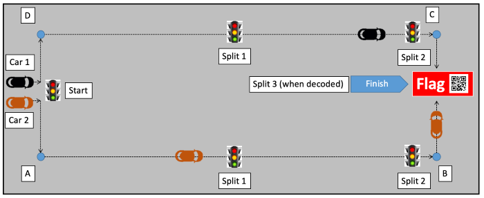

# Crawler Rollup

Authors: Isabella Kuhl, Laura Reeve, Joseph Rossi

2019-12-08

## Summary

In this final quest, our team implemented autonomous driving and web server control for our crawler by combining and building upon previous skills. More specifically, our crawler is able to detect traffic light beacons (provided by the instructors) and either stop or go, depending on the current light. It is also able to detect possible collisions and turn to avoid incoming obstacles, all without human interference. Finally, we used PID control to drive straight and maintain a desired speed. The final test for this project is a race course (Figure 1) featuring three traffic lights and a QR code finish line. The crawler must be able to complete this track, obeying the traffic lights, and switch to remote driving mode when it reaches the third light. From here the driver must drive up to the QR code finish line, scan and decode the image in order to complete the course.

Figure 1

## Evaluation Criteria

This quest combines elements of many skills in order to accomplish autonomous driving. These elements are broken up into two sections: web server interface and sensor functions.

#### Web Server Interface
The web server for this project had to be far more robust than previous quests in order to provide the user with the necessary information for autonomous driving. One of the main components is the ability to control speed and steering direction from the server. In addition to these controls, a live stream from a webcam mounted on the crawler has to be displayed for the user to operate the vehicle remotely. It also must include the ability to log the "splits" recorded which are defined as the time it takes to go from one stop light to the next. Lastly, the end of the course is reached when the QR code at the finish line is decoded. This requires the server to also be able to take an image of the code and display the encoded text.

#### Sensor Functions
In order to drive autonomously, it is necessary that it is outfitted with a number of sensors. The type and location of each sensor is up to the discretion of the team although the full system must accomplish the same tasks. One such task is PID control for speed and steering. This ensures the crawler is both driving straight as well as maintaining a constant, set speed. These sensors also must prevent front collisions, make appropriate left or right turns, and keep the crawler approximately 0.75 meters away from side walls. This distance is important as the traffic light beacons will be located this far from each wall. When a traffic light is detected the crawler should interpret the light using an IR receiver and react according to the current state (green–go, red–stop, yellow–slow down). Additionally, the split time between reaching each traffic light should be displayed on the vehicle using an alphanumeric display.

## Solution Design

### Webserver

The webserver provides interface for controlling and monitoring monitoring the crawler. The webserver can send commands to the crawler via a UDP port and exposes and HTTP API so the WebUI be used as a remote control.  (Figure 2)

 
(Figure 2 - Sending Crawler Commands)

 
 
<table>
    <thead>
        <tr>
            <th>Action</th>
            <th>Keys</th>
            <th>Mode</th>
        </tr>
    </thead>
    <tbody>
        <tr>
            <td>Auto Mode</td>
            <td>a</td>
            <td>Manual</td>
        </tr>
        <tr>
            <td>Stop Auto Mode</td>
            <td>p</td>
            <td>Auto</td>
        </tr>
        <tr>
            <td>Increment Forward</td>
            <td>f</td>
            <td>Manual</td>
        </tr>
        <tr>
            <td>Reverse</td>
            <td>r or b</td>
            <td>Manual</td>
        </tr>
        <tr>
            <td>Stop</td>
            <td>s or space</td>
            <td>Manual</td>
        </tr>
    </tbody>
</table>

It also exposes and HTTP API for logging and viewing split times. For logging split times, the crawler uses the HTTP API instead of sending UDP packets. We chose this so logging split times would be more reliable.

 

 
(Figure 3 - Logging Split Times)

For convenience when monitoring the crawler during development, the webpage also displays log messages send by the crawler over a UDP socket.

 

 
(Figure 4 - Sending log messages.)

Finally, the web interface shows the live feed from the Crawl-E Cam, a log of split times, and it will stream log messages sent by the crawler for remote debugging purposes.

Finally, the Web UI, uses jsQR to decode the live stream on the web client. About once a second, it will try to parse the image for a QR code and display the result if decoded successfully.

### Beacons

To receive commands from the IR transmitter "traffic light", we fixed an IR receiver to the front of the vehicle. It stays stopped when it's receiving "R" and then goes when it receives a "G" or "Y" signal. There are separate tasks for receiving messages from the beacon and interpreting them in the autonomous driving code. The receiving task will pass messages that it receives on a queue and the autonomous driving state machine will process and react to those messages appropriately. This is demonstrated in our video. One problem that we had was we couldn't get it to receive from >6 inches away, but it does read.

### Sensors

We used three sensors on our car to prevent collisions and keep the car moving along a wall. On the front of our car, we used the lidar lite, which continuously detected the wall directly in front of the car. On the right side, we used two microlidars, one towards the frony and one in the back. To stay along a wall, we continuously compared the readings from these two microlidars and adjusted the car to keep them both at ~72 cm (to keep the beacon approximately 75 cm away from the wall). The lidar lite on the front of the car was used to determine when to turn. We calculated that it takes the car ~5 full wheel revolutions (approximately 2.5 meters in the whole arc) to make a 90 degree turn and it moves 2 full meters forward while making this turn. Due to this, we have the car start turning when it’s 2.7 meters away from the wall, so that it finishes turning when it’s ~75 cm from the wall.

### Autonomous Driving

Using the components described above, autonomous driving is implemented as the state machine depicted below:

The state machine is modeled to navigate the course (Figure 1) and is programmed make left turns when detecting walls. The exit conditions all reset to the initial state. Autonomous driving exits when one of three things happens:

1. If collision hazard is detected, the crawler will stop.
2. When the crawler encounters the third beacon, it will exit autonomous mode.
3. If the crawler makes 2 left turns, it will stop the next time it detects that it should make a left. Per the course diagram, the third beacon will be along the third wall. If we hit a third left before encountering the third beacon, we missed a beacon, but should stop anyway.

## Sketches and Photos

 

## Supporting Artifacts
- [Link to repo](https://github.com/BU-EC444/Team15-Kuhl-Reeve-Rossi/tree/master/quest-6)
- [Link to video demo](https://drive.google.com/open?id=1fIa-mVAMV1z9HD00lwvAziglSVO0Ey2P)

## References

* We referenced Emily Lam's [beacon code](https://github.com/BU-EC444/code-examples/tree/master/ir-car-beacon-capture) to program our own traffic light beacons for testing.
* We referenced [this tutorial](https://www.raspberrypi.org/documentation/usage/webcams/) to setup webcam streaming on the Pi
-----

## Reminders

- Video recording in landscape not to exceed 90s
- Each team member appears in video
- Make sure video permission is set accessible to the instructors
- Repo is private
